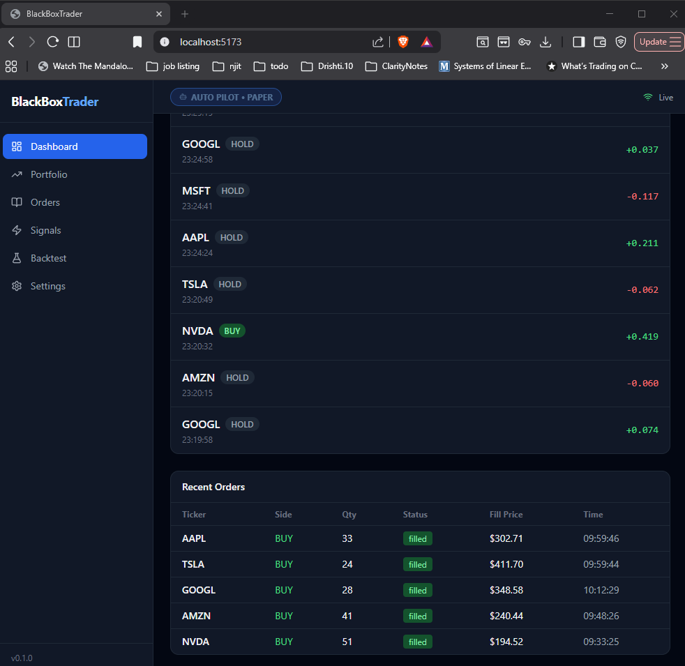
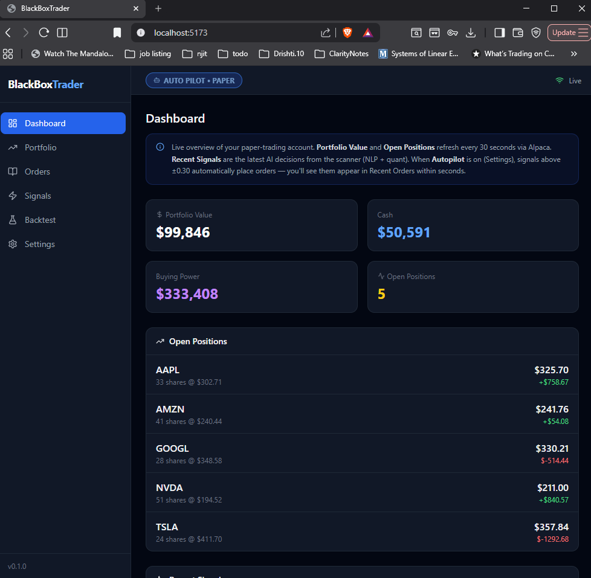
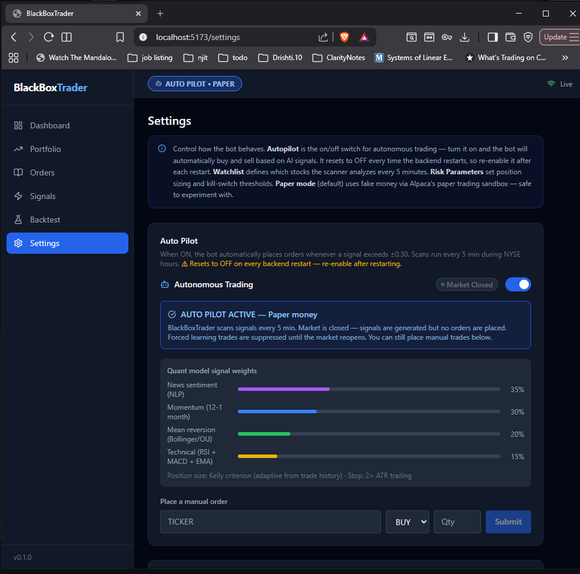

# BlackBoxTrader

BlackBoxTrader is a self-hosted, full-stack algorithmic trading platform. It scans a watchlist of stocks, generates buy/sell signals from a blend of technical, quantitative, and news/sentiment analysis, sizes and manages risk on positions, and can trade autonomously (paper or live) through Alpaca Markets. A React dashboard exposes signals, positions, orders, backtests, and an AI advisor chat for the whole system.

> ⚠️ **Disclaimer:** This is a personal/educational project, not financial advice. Algorithmic trading carries real financial risk. Always start with `TRADING_MODE=paper` and understand the code before ever pointing it at a live account. The author and contributors are not responsible for any financial losses incurred using this software.

> **Trading involves risk.** Live trading is disabled by default (`TRADING_MODE=paper`). Only switch to `live` once you've tested thoroughly with paper trading and understand the risk settings described below.

## How it works

```
┌─────────────┐      ┌──────────────────────────────────────────────┐      ┌────────────┐
│  Market data│      │                  Backend (FastAPI)            │      │  Frontend  │
│  - Alpaca   │─────▶│  quant_engine  → technical/momentum/mean-rev  │◀────▶│  (React +  │
│  - yfinance │      │  nlp_engine    → news + Reddit + FinBERT       │      │  Vite)     │
│  - News/    │      │  signal_combiner → weighted composite signal  │      │            │
│    Reddit   │      │  risk_manager  → position sizing, stop-loss,  │      │  Dashboard │
└─────────────┘      │                  drawdown/loss halts          │      │  Signals   │
                     │  trading_engine → order execution (Alpaca)    │      │  Portfolio │
                     │  adaptive      → learns from trade outcomes,  │      │  Orders    │
                     │                  tunes signal weights/regime  │      │  Backtest  │
                     │  advisor       → local LLM (Ollama) chat/Q&A  │      │  Settings  │
                     │  backtester    → vectorbt-based strategy test │      │  AI Advisor│
                     └──────────────────────────────────────────────┘      └────────────┘
```

## Features

- **Sentiment analysis** — local CPU inference on financial news headlines via FinBERT (no API calls, no data leaves your machine)
- **Quantitative signal & backtesting engine** — pandas/numpy-based strategy simulation
- **Risk management** — configurable per-trade risk %, max position size, drawdown/daily-loss halts
- **Broker integration** — Alpaca Markets for both paper and live trading (same API, one config flag apart)
- **Adaptive/autonomous trading loop** with a dashboard to monitor signals, positions, and orders in real time
- **React + TypeScript frontend** with live charts, portfolio view, and a "type CONFIRM" safety modal before enabling live trading

## Screenshots

| Dashboard — live signals | Dashboard — portfolio | Settings — autopilot & weights |
|---|---|---|
|  |  |  |

The autopilot bot scans the watchlist every 5 minutes during market hours, generates BUY/SELL/HOLD signals from a blended sentiment + quant model, and — when enabled — places paper trades automatically. Everything above is fake money via Alpaca's paper sandbox.

## Tech stack

| Layer     | Stack |
|-----------|-------|
| Backend   | Python 3.13, FastAPI, SQLAlchemy (async) + Alembic, APScheduler, `alpaca-py`, `yfinance`, `transformers`/`torch` (FinBERT), `vectorbt`, `pandas`/`numpy`/`scipy`, `PyPortfolioOpt` |
| Frontend  | React 18 + TypeScript, Vite, Tailwind CSS, TanStack Query, Zustand, `lightweight-charts`, `recharts` |
| Database  | SQLite (default, zero-config) or PostgreSQL (`asyncpg`) |
| Cache     | In-memory (default) or Redis, for real-time price streaming |
| AI advisor| Ollama running locally (e.g. `llama3.2:3b`) — no cloud LLM key required |
| Process mgmt | PM2 (optional, via `ecosystem.config.js`) for running both services as background daemons |

## Prerequisites

- **Python 3.13+**
- **Node.js 18+** and npm
- A free **Alpaca Markets** account (paper trading keys are free)
- Optional: **Ollama** for the AI advisor chat
- Optional: free **NewsAPI** / **GNews** keys for news sentiment
- Optional: Redis (only needed for real-time WebSocket price streaming at scale)

## Getting started

### 1. Clone the repo

```bash
git clone https://github.com/<your-username>/BlackBoxTrader.git
cd BlackBoxTrader
```

### 2. Configure environment variables

```bash
cp .env.example backend/.env
```

Edit `backend/.env` and fill in at least your Alpaca paper-trading keys:

```
ALPACA_API_KEY=your_alpaca_api_key_here
ALPACA_SECRET_KEY=your_alpaca_secret_key_here
TRADING_MODE=paper
```

`TRADING_MODE=paper` is the safe default — leave it unless you know what you're doing. `USE_SQLITE=true` and `USE_REDIS=false` are the zero-install defaults; change only if you run Postgres/Redis yourself.

### 3. Backend setup

```bash
cd backend
python -m venv .venv
.venv\Scripts\activate        # Windows
# source .venv/bin/activate   # macOS/Linux

pip install -e ".[dev]"

# Apply database migrations
alembic upgrade head

# (Optional) download FinBERT model weights for sentiment analysis
python ../scripts/download_finbert.py
```

### 4. Frontend setup

```bash
cd frontend
npm install
```

```bash
cd frontend
npm install
```

### 5. (Optional) FinBERT sentiment model

News/Reddit sentiment scoring needs the FinBERT weights downloaded once (~440MB):

```bash
python scripts/download_finbert.py
```

If you skip this, the app still runs — sentiment scoring is simply degraded/unavailable until the model is downloaded.

### 6. (Optional) AI advisor (local LLM)

Install Ollama, then pull a small model:

```bash
ollama pull llama3.2:3b
```

Ollama runs as a local service on `http://localhost:11434`. If it isn't running, the advisor chat just returns a friendly "Ollama is not running" message — the rest of the app is unaffected. You can later fine-tune a custom model on your own trade history with `python scripts/finetune_llm.py`.

### 7. Database migrations + seed data

```bash
python scripts/bootstrap.py
```

This applies Alembic migrations and seeds a default watchlist (`AAPL, MSFT, GOOGL, AMZN, NVDA`). The backend also auto-applies migrations and seeds a broader default watchlist on startup, so this step is optional but recommended for a clean first run.

## Running it

### Option A — one command (recommended for local dev)

```bash

```bash
python scripts/run_dev.py
```

python scripts/run_dev.py
```

Starts the backend (`uvicorn --reload`, port 8000) and frontend (`vite`, port 5173) together, and shuts both down cleanly on Ctrl+C.

### Option B — run each service manually

```bash
# Terminal 1 — backend
cd backend
python -m uvicorn app.main:app --reload --host 0.0.0.0 --port 8000
# or: start.cmd  (Windows)

# Terminal 2 — frontend
cd frontend
npm run dev
# or: run.cmd  (Windows)
```

### Option C — PM2 (background services, e.g. for always-on paper trading)

```bash
npm install -g pm2
pm2 start ecosystem.config.js
pm2 save        # persist across reboots
pm2 logs        # tail backend.log / frontend.log
pm2 stop all
```

Once running:

- **Frontend UI:** http://localhost:5173
- **Backend API + docs (Swagger):** http://localhost:8000/docs
- **Health check:** http://localhost:8000/health

## Trading modes

BlackBoxTrader defaults to **paper trading** (simulated money, real market data) and **dry-run execution** — signals are generated but no orders are placed until you explicitly enable execution.

To switch to live trading (real money), you must explicitly confirm via the API or the Settings page in the UI:

```
POST /api/v1/settings/mode
{ "mode": "live", "confirm": true }
```

The frontend requires typing `CONFIRM` in a modal before this takes effect. Do not enable live mode until you've backtested and understand your strategy's risk profile.

## Project structure

```
BlackBoxTrader/
├── backend/
│   ├── app/
│   │   ├── api/              # FastAPI routes (REST + WebSocket)
│   │   ├── core/             # config, security, shared utilities
│   │   ├── db/               # SQLAlchemy models & Alembic migrations
│   │   ├── models/           # ORM models
│   │   ├── schemas/          # Pydantic schemas
│   │   ├── services/
│   │   │   ├── adaptive/     # self-tuning strategy logic
│   │   │   ├── advisor/      # trade recommendations
│   │   │   ├── backtester/   # strategy backtesting engine
│   │   │   ├── market_data/  # price/data feeds
│   │   │   ├── nlp_engine/   # FinBERT sentiment pipeline
│   │   │   ├── quant_engine/ # signal generation
│   │   │   ├── risk_manager/ # position sizing & halts
│   │   │   └── trading_engine/# broker integration & order execution
│   │   └── tasks/            # scheduled jobs
│   └── tests/
├── frontend/
│   └── src/
│       ├── api/              # API client
│       ├── components/       # feature-organized React components
│       ├── hooks/, store/, types/
│       └── pages/
├── scripts/                   # dev/setup scripts (run_dev.py, download_finbert.py, ...)
└── ecosystem.config.js        # optional PM2 config for running as background services
```
```

## Running tests

```bash
cd backend
pytest
```

## Running tests

Run the test suite with:

```bash
pytest
```

## Troubleshooting

- **"Migration failed" on startup** — usually harmless if tables already exist; check `backend/blackbox.db` was created and re-run `python scripts/bootstrap.py` if unsure.
- **No sentiment scores** — run `python scripts/download_finbert.py` and confirm `NEWSAPI_KEY`/`GNEWS_API_KEY` are set.
- **Advisor chat says Ollama isn't running** — install/start Ollama and `ollama pull llama3.2:3b`.
- **No live price updates** — this is expected without Redis; the in-memory cache still polls on the configured intervals. Set `USE_REDIS=true` with a running Redis instance for WebSocket streaming.

## Optional: running as a background service (PM2)

For longer-running deployments, an included PM2 config runs both backend and frontend as managed services:

```bash
npm install -g pm2
pm2 start ecosystem.config.js
pm2 save
```

## Security note

`backend/.env` holds your real API keys/secrets and is git-ignored — never commit it. Use `.env.example` as the template. If you fork this repo, double-check `git status` before pushing to make sure no local `.env` file is accidentally staged.

## License

MIT — see [LICENSE](LICENSE).
